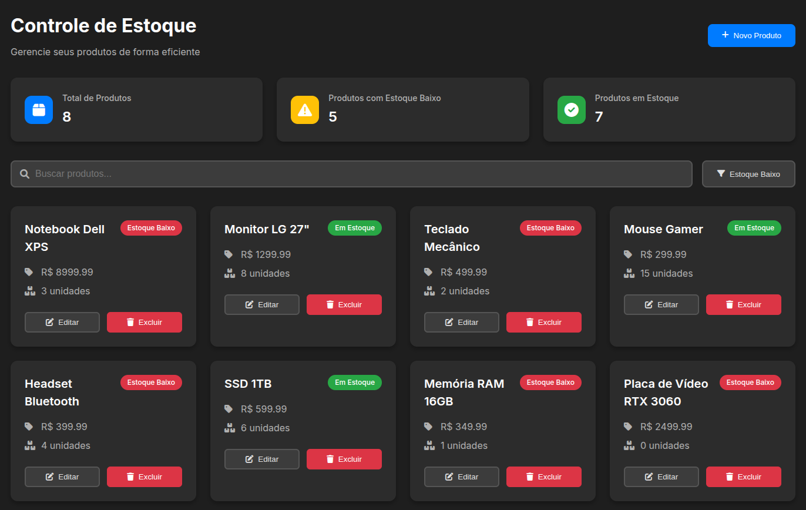

# 📦 Stock Control - Modern Frontend

[](https://angular.io/)
[](https://www.typescriptlang.org/)
[](https://developer.mozilla.org/en-US/docs/Web/HTML)
[](https://developer.mozilla.org/en-US/docs/Web/CSS)
[](https://fontawesome.com/)

A modern frontend project to manage a simple stock control system, developed with Angular. This project focuses on a clean, intuitive, and responsive user interface, simulating operations of a stock management system.

**Key Features (Mocked Data):**

- Attractive product cards visualization.
- Visual indicators for low stock products.
- Dashboard with quick statistics (total, low stock, in stock).
- Search and filter functionality (by low stock).
- Add new products via a modal with a blurred background.
- Edit existing products via modal.
- Delete products with a confirmation modal.
- Responsive interface, adaptable to different screen sizes.
- Modern dark theme.

## 📸 Screenshot



Replace the image above with a screenshot of your running project. To do this:

1.  Run the application with `ng serve`.
2.  Open the browser and capture a screenshot of the main interface (the product list in dark theme is a good choice).
3.  Save the image in a folder, for example, `assets/images` in the root of your project.
4.  Make sure the file name in the markdown markup above (`assets/images/screenshot.png`) matches the name of the file you saved and adjust if necessary.

## 🚀 Technologies Used

- **Angular**: Framework for building the Single Page Application.
- **TypeScript**: Language for development with static typing.
- **HTML5/CSS3**: Structure and styling of the interface.
- **Font Awesome**: Icon library.
- **Mocked Data**: API simulation for CRUD operations in the frontend.

## ⚙️ Backend

This frontend project was developed to integrate with a backend built in **Java** using the **Spring** framework.

Backend Repository: https://github.com/pnascimentodev/stock 

## ▶️ How to Run the Project

Make sure you have Node.js and Angular CLI installed on your machine.

1.  Clone this repository:
    ```bash
    git clone https://github.com/pnascimentodev/stock-front.git
    ```
2.  Navigate to the project directory:
    ```bash
    cd stock-front
    ```
3.  Install dependencies:
    ```bash
    npm install
    # or yarn install
    ```
4.  Start the development server:
    ```bash
    ng serve
    ```
5.  Open your browser at `http://localhost:4200/`.

## 👋 Connect with Me 🐱
<p align="center">
[](https://www.linkedin.com/in/devpnascimento/)
</p>
---
